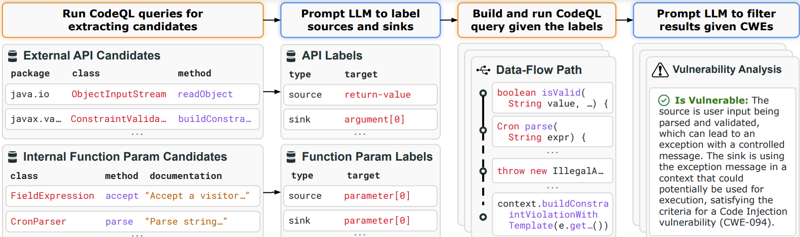

# IRIS 
IRIS is a neurosymbolic framework that combines LLMs with static analysis for security vulnerability detection. IRIS uses LLMs to generate source and sink specifications and to filter false positive vulnerable paths. 

- [Workflow](#workflow)
- [Dataset](#dataset)
- [Environment Setup](#environment-setup)
- [Quickstart](#quickstart)
- [Supported CWEs](#supported-cwes)
- [Supported Models](#supported-models)
- [Adding a CWE](#adding-a-cwe)
- [Contributing](#contributing-and-feedback)
- [Citation](#citation)
- [Team](#team)

## Workflow

At a high level, IRIS takes a project and a CWE (vulnerability class, such as path traversal vulnerability or CWE-22) as input, statically analyzes the project, and outputs a set of potential vulnerabilities (of type CWE) in the project. To achieve this, IRIS takes the following steps:



1. First we create CodeQL queries to collect external APIs in the project and all internal function parameters. 
2. We use an LLM to classify the external APIs as potential sources, sinks, or taint propagators. In another query, we use an LLM to classify the internal function parameters as potential sources. We call these taint specifications.
3. Using the taint specifications from step 2, we build a project-specific and cwe-specific (e.g., for CWE 22) CodeQL query. 
4. Then we run the query to find vulnerabilities in the given project and post-process the results. 
5. We provide the LLM the post-processed results to filter out false positives and determine whether a CWE is detected.  

## Dataset 
We have curated a dataset of Java projects, containing 120 real-world previously known vulnerabilities across 4 popular vulnerability classes. 

[CWE-Bench-Java](https://github.com/iris-sast/cwe-bench-java)

## Environment Setup

We support multiple ways to run IRIS:
- [Linux Setup](#environment-setup-linux)
- [Docker Setup](#environment-setup-docker)
- [Other Systems](#environment-setup-other)

## Environment Setup Linux
First, clone the repository. We have included `cwe-bench-java` as a submodule, so use the following command to clone correctly:
```bash
$ git clone https://github.com/iris-sast/iris --recursive
```
<details>
<summary>Installation Steps</summary>
  
### Step 1. Conda environment  
Run `scripts/setup_environment.sh`. 
```bash
$ chmod +x scripts/setup_environment.sh
$ bash ./scripts/setup_environment.sh
```
This will do the following:
- creates a conda environment specified by environment.yml
- installs our [patched version of CodeQL 2.15.3](https://github.com/iris-sast/iris/releases/tag/codeql-0.8.3-patched). This version of CodeQL **is necessary** for IRIS. To prevent confusion in case users already have an existing CodeQL version, we unzip this within the root of the iris directory. Then we add a PATH entry to the path of the patched CodeQL's binary.
- creates a directory to store CodeQL databases. 

### Get the JDKs needed 
We have included CWE-Bench-Java as a submodule in IRIS in the data folder. We have also provided scripts to fetch and build Java projects to be used with IRIS. 

For building, we need Java distributions as well as Maven and Gradle for package management. In case you have a different system than Linux x64, please modify `data/cwe-bench-java/scripts/jdk_version.json`, `data/cwe-bench-java/scripts/mvn_version.json`, and `data/cwe-bench-java/scripts/gradle_version.json` to specify the corresponding JDK/MVN/Gradle files. In addition, please prepare 3 versions of JDK and put them under the java-env folder. Oracle requires an account to download the JDKs, and we are unable to provide an automated script. Download from the following URLs:

JDK 7u80: https://www.oracle.com/java/technologies/javase/javase7-archive-downloads.html

JDK 8u202: https://www.oracle.com/java/technologies/javase/javase8-archive-downloads.html

JDK 17: https://www.oracle.com/java/technologies/javase/jdk17-archive-downloads.html

At this point, your `java-env` directory should look like 
```
- data/cwe-bench-java/java-env/
  - jdk-7u80-linux-x64.tar.gz
  - jdk-8u202-linux-x64.tar.gz
  - jdk-17_linux-x64_bin.tar.gz
```

After this proceed to step 2 on fetching and building Java projects.

### Step 2. Fetch and build Java projects
Now run the fetch and build script. You can also choose to fetch and not build, or specify a set of projects. You can find project names in the project_slug column in `cwe-bench-java/data/build_info.csv`.
```bash
# fetch projects and build them
$ python3 data/cwe-bench-java/scripts/setup.py

# fetch projects and don't build them
$ python3 data/cwe-bench-java/scripts/setup.py --no-build

# example - build the perwendel__spark_CVE-2018-9159_2.7.1 project 
$ python3 data/cwe-bench-java/scripts/setup.py --filter perwendel__spark_CVE-2018-9159_2.7.1

# example - only build projects under CWE-022 and CWE-078
$ python3 data/cwe-bench-java/scripts/setup.py --cwe CWE-022 CWE-078 

# example - only build keycloak projects 
$ python3 data/cwe-bench-java/scripts/setup.py --filter keycloak 

# example - do not build any apache related projects
$ python3 data/cwe-bench-java/scripts/setup.py --exclude apache       
```
This will create the `build-info` and `project-sources` directories. It will also install JDK, Maven, and Gradle versions used to build the projects in `cwe-bench-java`. `build-info` is used to store build information and `project-sources` is where the fetched projects are stored.

### Step 3. Generate CodeQL databases
To use CodeQL, you will need to generate a CodeQL database for each project. We have provided a script to automate this. The script will generate databases for all projects found in `data/cwe-bench-java/project-sources`. To generate a database for a specific project, use the `--project` argument. 
```bash
# build CodeQL databases for all projects in project-sources
$ python3 scripts/build_codeql_dbs.py 

# build a specific CodeQL database given the project slug
$ python3 scripts/build_codeql_dbs.py --project perwendel__spark_CVE-2018-9159_2.7.1 
```

### Step 4. Check IRIS directory configuration in `src/config.py`
By running the provided scripts, you won't have to modify `src/config.py`. Double check that the paths in the configuration are correct. Each path variable has a comment explaining its purpose.

## Quickstart
Make sure you have followed all of the environment setup instructions before proceeding! 

`src/neusym_vul.py` is used to analyze one specific project. `src/neusym_vul_for_query.py` is used to analyze multiple projects. Results are written to the `output` directory.

See the [Supported CWEs](#supported-cwes) section for `--query` arguments and the [Supported Models](#supported-models) section for `--llm` arguments.

The following is an example of using IRIS to analyze perwendel__spark_CVE-2018-9159_2.7.1 for vulnerabilities that fall under CWE-022, using qwen2.5-coder-7b. Query `cwe-022wLLM` refers to [cwe-22 path traversal](https://cwe.mitre.org/data/definitions/22.html). You should be able to immediately execute this command to see an example of an evaluation.  

```bash
$ python3 src/neusym_vul.py --query cwe-022wLLM --run-id <SOME_ID> --llm qwen2.5-coder-7b perwendel__spark_CVE-2018-9159_2.7.1
```

The following is an example of using IRIS to analyze zerotunaround for vulnerabilities that fall under CWE-022, using GPT-4. Query `cwe-022wLLM` refers to [cwe-22 path traversal](https://cwe.mitre.org/data/definitions/22.html). 
```bash
$ python3 src/neusym_vul.py --query cwe-022wLLM --run-id <SOME_ID> --llm gpt-4 zeroturnaround__zt-zip_CVE-2018-1002201_1.12
```
</details>

### Outputs

After Step 4, IRIS will generate `results.sarif` and `results_pp.sarif` files in `output/[project-name]/cwe-XXwLLM` containing the vulnerabilities found in the project before and after posthoc filtering. You can download [Sarif Viewer](https://marketplace.visualstudio.com/items?itemName=MS-SarifVSCode.sarif-viewer) to view the sarif files. Additionally, `results.csv` contains the vulnerabilities in a simplified form.

<details>
  <summary>Example Output directory structure (using run-id test1): </summary>
  
```
output
├── common
│   └── test1
│       └── cwe-022 (cache of common specs, can be reused across projects)
└── perwendel__spark_CVE-2018-9159_2.7.1
    └── test1
        ├── common
        │   ├── func_params.csv (list of all function parameters in the project)
        │   ├── llm_labelled_source_func_params.json (function parameters labelled as sources by LLM)
        │   ├── logs (Log files and raw LLM outputs)
        │   │   └── label_func_params
        │   │       ├── raw_llm_response_0.txt
        │   │       ├── raw_llm_response_20.txt
        │   │       ...
        │   └── source_func_param_candidates.csv
        ├── cwe-022 
        │   ├── MySinks.qll (Codeql file listing all sink specifications returned by LLM)
        │   ├── MySources.qll (Codeql file listing all source specifications returned by LLM)
        │   ├── MySummaries.qll (Codeql file listing all summary specifications returned by LLM)
        │   ├── Spec.yml (Alternate yml file listing all the specs)
        │   ├── candidate_apis.csv (candidate specs)
        │   ├── external_apis.csv 
        │   ├── llm_labelled_sink_apis.json (sinks labelled by LLM)
        │   ├── llm_labelled_source_apis.json (sources labelled by LLM)
        │   ├── llm_labelled_taint_prop_apis.json (taint propagators labelled by LLM)
        │   └── logs (intermediate logs)
        │       └── label_apis
        │           ├── raw_llm_response_0.txt
        │           ├── ...
        │           ├── raw_user_prompt_0.txt
        │           ├── ...
        ├── cwe-022wLLM (final results with all the vulnerabilities)
        │   ├── results.csv
        │   ├── results.sarif (before contextual filtering)
        │   └── results_pp.sarif (after contextual filtering)
        ├── cwe-022wLLM-final
        │   └── results.json (results statistics)
        ├── cwe-022wLLM-posthoc-filter (results of contextual filtering)
        │   ├── logs
        │   │   ├── raw_llm_response_0_0.txt
        │   │   ├── raw_llm_response_0_1.txt
        │   │   ├── ...
        │   ├── results.json
        │   ├── results.sarif
        │   └── stats.json
        ├── fetch_* (intermediate analysis results)
        │   ├── ...
        └── log (Main log files)
            ├── ...       
```

</details>


## Environment Setup Docker
The dockerfile has scripts that will create the conda environment, clones `cwe-bench-java`, and installs the patched CodeQL version. Before building the dockerfile you will need download the JDK versions needed. Then the dockerfile copies them to the container. 

### Get the JDKs needed 
For building, we need Java distributions as well as Maven and Gradle for package management. In addition, please prepare 3 versions of JDK and **put them in the iris root directory**. Oracle requires an account to download the JDKs, and we are unable to provide an automated script. Download from the following URLs:

JDK 7u80: https://www.oracle.com/java/technologies/javase/javase7-archive-downloads.html

JDK 8u202: https://www.oracle.com/java/technologies/javase/javase8-archive-downloads.html

JDK 17: https://www.oracle.com/java/technologies/javase/jdk17-archive-downloads.html

At this point, your `iris` directory should look like 
```
- /iris
  - jdk-7u80-linux-x64.tar.gz
  - jdk-8u202-linux-x64.tar.gz
  - jdk-17_linux-x64_bin.tar.gz
```

Now, build and run the docker container. 
```bash
# build
$ docker build -t iris .
# run
$ docker run -it iris
# run with all GPUs 
$ docker run --gpus all -it iris
# run with specific GPUs
$ docker run --gpus '"device=0,1"' -it iris
```
Confirm that the patched CodeQL is in your PATH.

After this, proceed to step 2 on fetching and building Java projects.

## Environment Setup Other

**Mac**: If you have a Mac, you can also run IRIS. You must separately install java libraries using the dmg files provided by oracle (using the same links mentioned [here](#get-the-jdks-needed)). Please specify the appropriate Java directories in `data/cwe-bench-java/scripts/jdk_version.json`. Alternatively, you can use the provided dockerfile for setup.

**Windows**: We have not evaluated IRIS on windows machines. If you are interested in extending IRIS's support to windows machines, please feel free to raise a PR.

## Supported CWEs
Here are the following CWEs supported, that you can specify as an argument to `--query` when using `src/neusym_vul.py` and `src/neusym_vul_for_query.py`. 

- `cwe-022wLLM` - [CWE-022](https://cwe.mitre.org/data/definitions/22.html) (Path Traversal)
- `cwe-078wLLM` - [CWE-078](https://cwe.mitre.org/data/definitions/78.html) (OS Command Injection)
- `cwe-079wLLM` - [CWE-079](https://cwe.mitre.org/data/definitions/79.html) (Cross-Site Scripting)
- `cwe-094wLLM` - [CWE-094](https://cwe.mitre.org/data/definitions/94.html) (Code Injection)


## Supported Models
We support the following models with our models API wrapper (found in `src/models`) in the project. Listed below are the arguments you can use for `--llm` when using `src/neusym_vul.py` and `src/neusym_vul_for_query.py`. You're free to use your own way of instantiating models or adding on to the existing library. Some of them require your own API key or license agreement on HuggingFace. 

<details>
  <summary>List of Models</summary>
  
### Codegen
- `codegen-16b-multi`
- `codegen25-7b-instruct`
- `codegen25-7b-multi`

### Codellama
#### Standard Models
- `codellama-70b-instruct`
- `codellama-34b`
- `codellama-34b-python`
- `codellama-34b-instruct`
- `codellama-13b-instruct`
- `codellama-7b-instruct`

### CodeT5p
- `codet5p-16b-instruct`
- `codet5p-16b`
- `codet5p-6b`
- `codet5p-2b`

### DeepSeek
- `deepseekcoder-33b`
- `deepseekcoder-7b`
- `deepseekcoder-v2-15b`

### Gemini
- `gemini-1.5-pro`
- `gemini-1.5-flash`
- `gemini-pro`
- `gemini-pro-vision`
- `gemini-1.0-pro-vision`

### Gemma
- `gemma-7b`
- `gemma-7b-it`
- `gemma-2b`
- `gemma-2b-it`
- `codegemma-7b-it`
- `gemma-2-27b`
- `gemma-2-9b`

### GPT
- `gpt-4`
- `gpt-3.5`
- `gpt-4-1106`
- `gpt-4-0613`

### LLaMA
#### LLaMA-2
- `llama-2-7b-chat`
- `llama-2-13b-chat`
- `llama-2-70b-chat`
- `llama-2-7b`
- `llama-2-13b`
- `llama-2-70b`

#### LLaMA-3
- `llama-3-8b`
- `llama-3.1-8b`
- `llama-3-70b`
- `llama-3.1-70b`
- `llama-3-70b-tai`

### Mistral
- `mistral-7b-instruct`
- `mixtral-8x7b-instruct`
- `mixtral-8x7b`
- `mixtral-8x22b`
- `mistral-codestral-22b`

### Qwen
- `qwen2.5-coder-7b`
- `qwen2.5-coder-1.5b`
- `qwen2.5-14b`
- `qwen2.5-32b`
- `qwen2.5-72b`

### StarCoder
- `starcoder`
- `starcoder2-15b`

### WizardLM
#### WizardCoder
- `wizardcoder-15b`
- `wizardcoder-34b-python`
- `wizardcoder-13b-python`

#### WizardLM Base
- `wizardlm-70b`
- `wizardlm-13b`
- `wizardlm-30b`

</details>

## Adding a CWE
Coming soon! 

## Contributing and Feedback
Feel free to address any open issues or add your own issue and fix. We love feedback! Please adhere to the following guidelines. 

1. Create a Github issue outlining the piece of work. Solicit feedback from anyone who has recently contributed to the component of the repository you plan to contribute to. 
2. Checkout a branch from `main` - preferably name your branch `[github username]/[brief description of contribution]`
3. Create a pull request that refers to the created github issue in the commit message.
4. To link to the github issue, in your commit for example you would simply add in the commit message:
[what the PR does briefly] #[commit issue]
5. Then when you push your commit and create your pull request, Github will automatically link the commit back to the issue. Add more details in the pull request, and request reviewers from anyone who has recently modified related code.
6. After 1 approval, merge your pull request.

## Citation 
Consider citing our paper:
```
@inproceedings{li2025iris,
title={LLM-Assisted Static Analysis for Detecting Security Vulnerabilities},
author={Ziyang Li and Saikat Dutta and Mayur Naik},
booktitle={International Conference on Learning Representations},
year={2025},
url={https://arxiv.org/abs/2405.17238}
}
```
[Arxiv Link](https://arxiv.org/abs/2405.17238)

## Team

IRIS is a collaborative effort between researchers at the University of Pennsylvania and Cornell University. Please reach out to us if you have questions about IRIS.

[Ziyang Li](https://liby99.github.io)

[Claire Wang](https://clairewang.net)

[Saikat Dutta](https://www.cs.cornell.edu/~saikatd)

[Mayur Naik](https://www.cis.upenn.edu/~mhnaik)


